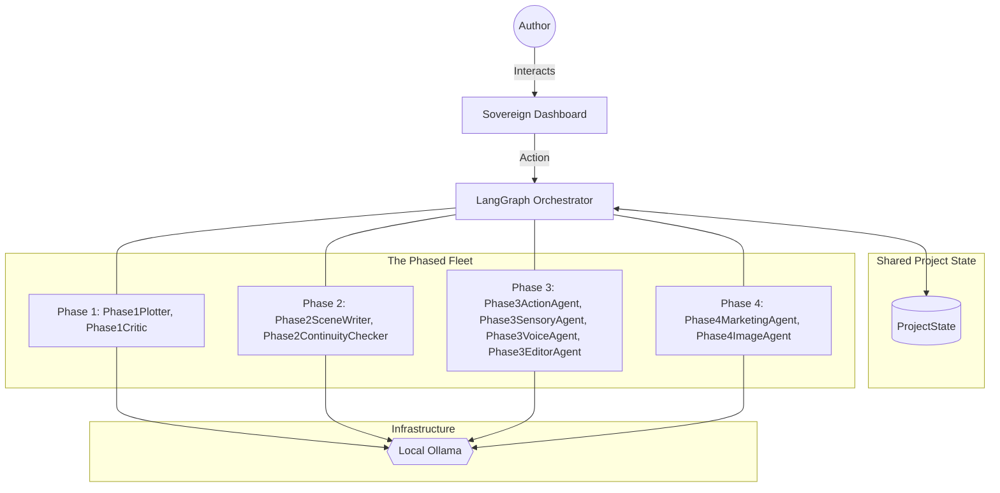

# Architecture Summary: BookBot_07

This document outlines the high-level architecture and component interactions of the BookBot Narrative Engine.

## 1. System Overview
BookBot_07 follows a **Phased Pipeline with Shared State**. The system progresses through 4 distinct phases (Planning to Publishing). While the overall structure is linear, agents can be revisited and re-run as needed.

## 2. Component Diagram
The following diagram visualizes the phased pipeline and shared state model.

## 3. Layer Definitions

### UI Layer (Sovereign Dashboard)
A responsive dashboard providing views for different facets of creation:
- **World Bible Tab**: Full management of characters, locations, and items.
- **Style & Voice**: Configuration for tone, stylistic rules, and reference samples.
- **Split-Screen Drafting**: AI multi-pass drafting on the left, adversarial redlines and shadow context on the right.
- **Audit Log**: Conflict registry and real-time session telemetry.
- **Project Selector**: Sidebar for managing snapshots and iterations.

### Orchestration Layer (LangGraph)
Manages the phased execution and agent transitions. It ensures that:
- The project state is propagated correctly between phases.
- Multi-pass loops for drafting (Phase 4) are executed in sequence.
- Continuity is maintained via the shared World Bible.

### Agent Layer (The Fleet)
A non-linear fleet of specialized personas organized by creation phase:

- **Phase 1: Planning**
    - **Phase1Plotter**: Manages high-level schema, characters, events, and plot "North Star."
    - **Phase1Critic**: Contrarian that challenges clichés and highlights plot holes.
- **Phase 2: Outlining**
    - **Phase2SceneWriter**: Generates chapter beats and narrative structure.
    - **Phase2ContinuityChecker**: Ensures the chapter outlines flow logically.
- **Phase 3: Drafting**
    - **Phase3ActionAgent**: Writes the first pass skeletal draft focusing on action.
    - **Phase3SensoryAgent**: Layers atmospheric details into the draft.
    - **Phase3VoiceAgent**: Applies stylistic rules and character voices.
    - **Phase3EditorAgent**: Polishes prose and generates summaries.
- **Phase 4: Publishing & Marketing**
    - **Phase4MarketingAgent**: Generates blurbs and kindle marketing copy.
    - **Phase4ImageAgent**: Generates prompts for AI art generators based on visual styles.

### Robustness Layer (Deterministic Logic)
The "Pythonic-First" component that protects the system from LLM non-determinism. It performs:
- **Block Stripping**: Removing thinking tags or conversational filler.
- **JSON Validation**: Ensuring the agent's output conforms to the registry schema.
- **Fallback Handling**: Graceful degradation if the LLM fails to provide a usable response.
