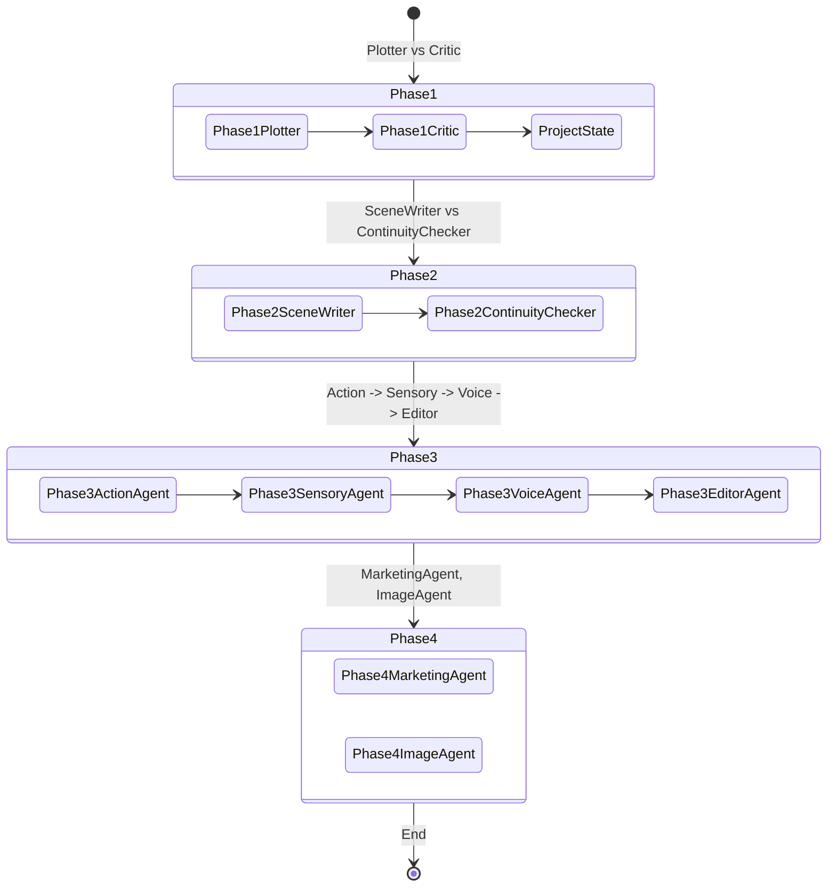

# Narrative Workflow: BookBot_07

This document defines the end-to-end creation process and the data transformations between phases.

## 1. Creation Lifecycle
BookBot_07 utilizes a multi-step pipeline where each phase builds upon the structured output of the previous one.

## 2. Data Element Map

| Phase | Input Elements | Output Elements | Key Data Objects |
|-------|----------------|-----------------|------------------|
| **1. Planning** | Idea / Prompt | Plot Plan, Characters, Setting, Events | `ProjectState.characters`, `ProjectState.book_plan` |
| **2. Outlining** | Plan, Characters | Chapter Outlines | `ProjectState.chapters` |
| **3. Drafting** | Chapter Outlines, Summaries | Layered Draft Prose | `Chapter.draft`, `Chapter.summary` |
| **4. Publishing & Marketing** | Project Context, Drafts | Blurbs, Copy, Image Prompts | `ProjectState.blurb`, `Chapter.image_prompt` |

## 3. Propagation Integrity
To prevent the "Regression" issue seen in v0.5, data propagation follows these rules:
- **Upward-Only Flow**: While a user can go back to Phase 1 to change a plot point, doing so must trigger a "Dirty State" flag in subsequent phases, requiring a re-sync rather than an automated (and potentially destructive) overwrite.
- **Context Pruning**: The **Drafting Fleet (Phase 4)** is given the **Chapter Skeleton** + **World Bible Summary** + **Previous Chapter Summary** + **Last 1000 words of previous chapter**. It is *not* given the full text of all previous chapters, preserving context window and focus.
- **Human-in-the-Loop**: Each phase transition requires a manual "Commit" from the user to ensure the AI's structural decisions align with the author's vision.
